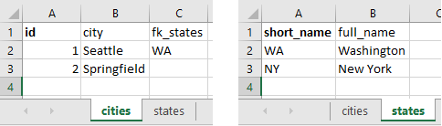

[](https://github.com/michaelneu/webxcel)
[](https://github.com/michaelneu/webxcel)
[](https://github.com/michaelneu/webxcel)
[](https://github.com/michaelneu/webxcel)
[](https://github.com/michaelneu/webxcel)
[](https://app.fossa.io/projects/git%2Bgithub.com%2Fmichaelneu%2Fwebxcel?ref=badge_shield)

Webxcel creates a full-fledged RESTful web backend from your Microsoft Excel workbooks. It is written in 100% plain Visual Basic macros and comes with a lot of handy tools to help you build the next big thing.


## Features

#### Rapid prototyping

Build your web applications using the autogenerated RESTful CRUD endpoints and the static file server. Webxcel even supports mapping worksheet relationships, so you can model your table schema as flexible as you wish.

To configure a new table, simply insert your column names in the first row of an empty sheet and make the cell of your primary key **bold**. References to other tables can be introduced using `fk_<table>` columns and foreign keys:



When accessing `GET /workbook/cities`, webxcel will return a fully mapped JSON object (response formatted for better readability): 

```http
HTTP/1.1 200 OK
Content-Type: application/json
Server: Microsoft Excel/16.0
Content-Length: 200
Connection: close

[
  {
    "id": "1",
    "city": "Seattle",
    "states": {
      "short_name": "WA",
      "full_name": "Washington"
    }
  },
  {
    "id": "2",
    "city": "Springfield",
    "states": null
  }
]
```


#### Batteries already included

No need to spin up a cloud server or function-as-a-service provider, implement rich server side logic right in Microsoft Excel using the built-in tools you already know and love. Using Microsoft Excel's immersive charting, you can gather even deeper insights from your data. 


#### Scalable

Webxcel supports scaling from a mere 10% to 400% for extreme detailed data insights. This makes it a perfect fit for small startups to global corporations. By default, webxcel projects are scaled 100%, but you can adjust this setting in the lower right corner of Microsoft Excel to fit your needs.


#### Ready for deployment

Many new devices come with Microsoft Office preinstalled, most of the time you won't have to do any setup at all. Deploying a project is as easy as dropping the file on the server and starting webxcel. Also backup is a no-brainer, simply copy and paste the project file to your backup location (e.g. a flash drive) and you're all set.


#### Future proof with compatibility in mind

Webxcel is built on Windows Sockets 2 and runs on any Microsoft Excel version starting from Microsoft Office 2007, but should work on any macro enabled setup.


#### Hassle-free PHP

Everybody hates PHP configurations. That's why webxcel ships with a PHP plugin that just works, no configuration needed. It's like serverless but better!


#### Missing something?

Check out the [features project](https://github.com/michaelneu/webxcel/projects/2) to get the latest news and ideas for webxcel, or file a [new issue](https://github.com/michaelneu/webxcel/issues/new).


## Getting started

To quickstart development, check out the [example folder](example) for a simple todo app using React and webxcel.


#### Creating new projects

The `build.ps1` PowerShell script creates an empty webxcel project in `build/webxcel.xlsm`, which you can alter to create your table schema. You can also import the classes and modules by hand, but this will consume considerably more time since the import dialog only allows you to select one file at a time.

In order for the build script to succeed, you may have to make a few changes to your Excel settings. Open the Trust Center in the options menu, select Macro Settings and check the following options:
- Enable all macros
- Trust access to the VBA project object model

If you can't run the build script at all, use the following command to temporarily enable PowerShell scripts for the duration of your [PowerShell session](https://docs.microsoft.com/en-us/powershell/module/microsoft.powershell.security/set-executionpolicy?view=powershell-6#notes):
```powershell
Set-ExecutionPolicy -ExecutionPolicy Unrestricted -Scope Process
```

#### Running webxcel

Webxcel can be started using either the `Main` sub through the developer ribbon or by assigning it to an interactive component like a button. Once started, webxcel will serve all static files located in the same directory as your project's `.xlsm`. 

During webxcel's runtime, Microsoft Excel will not respond. This is due to Visual Basic being executed on the main UI thread. As this is a known issue, webxcel creates a lockfile `<project>.xlsm.lock`, which you can delete to gracefully shut down the server. You also could force-quit Microsoft Excel, but this might result in the port being blocked from further usage until a reboot (webxcel will raise the error [`ErrorSocketBind`](src/Modules/StatusCode.bas) whenever it can't bind to a specific port).


## Contributing

To contribute, clone the repository, build an empty webxcel project and start hacking in the Visual Basic editor (Alt + F11). Once you've finished your contribution, export your classes or modules and create a [pull request](https://github.com/michaelneu/webxcel/compare). As Visual Basic is case-insensitive, please check your exported classes to minimize renaming commits (e.g. after introducing a new variable `Dim name` and the editor globally renamed `Name` to `name`).


## Is it any good?

[Yes](https://news.ycombinator.com/item?id=3067434).


## License

Webxcel is released under the [MIT license](LICENSE).
